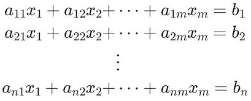

## CSCI 114 Assignment #2

For this assignment you will write two programs that will help you get more experience implementing and using structs and classes in C++.

### Periodic Table Database

For the first program you will read in data about the elements in the periodic table. You will process this data into several data structures so that your program can search the data.

The struct for the elements is as follows:

```
struct Element {
	Element() :
	symbol(),name(),number(0),atomic_mass(0.0),type() {};
	
	string symbol; //e.g "H", "He"
	string name; //e.g "Hydrogen", "Helium"
	int number; //e.g 1, 2
	double atomic_mass; //e.g. 1.008, 4.0026
	string phase; //phase at room temp e.g gas, liquid, solid
	string type; //e.g. "transitional metals", "noble gas"
};
```
The data for the period table will be given as a comma seperated data file with one element per line. There will be 118 elements, though they may not be in the data file in numerical order. The first line of the file can help you figure out which column in th data contains the various data items. The first line should be ignored by your program.

#### The program

Your program will be an interactive interface to the periodic table data. After parsing the data your program should ask the user which element they are interested in.

If the user enters a number between 1 and 118 (inclusive) you should display the data for that element.

If the user enters a string of length 1 or 2, you will search for an element by the symbol. If the user enters a string of length greater than 2 you will search for the element by name.

If the element is not found by symbol or name, print "not found."

The exception is the word `quit` which will cause the program to quit. Any other input other than described should prompt the user to try again.

#### The data structures

The main data structure will be a `vector` of `Element` of size 119:

```
vector<Element> elements(119);
```

You will parse each line of the input file into an `Element` object and then place it at the index that corresponds to the elements atomic number (e.g. Hydrogen is at index 1). For simplicity we will have a dummy element 0 where the string values will be the empty string and the numerical values will be zero.

You will use this vector to search by index, aka the element number.

However, many applications require searching by other criteria and that search should be "fast", i.e better than O(n). We can do this by building what is called a secondary index to aid search.

To do this we will introduce the idea of the pair. A pair is a simple struct that associates two values:

```c++
#include <utility>

std::pair<string, int> p("He", 2);
```
The above snippet creates a `pair` struct that can associate a `string` with an `int`. With it we can map `He -> 2`, and thus lookup the appropriate entry in the `vector` of Elements.

If we need to access the elements we can do:

```
p.first = "Carbon";
p.second = 6
```

To implement our program we need to implement two secondary indexes. The first is a `vector` of `string:int` pairs where the first entry is the name of the element and the second is the atomic number. Similarlly, we need a `vector` of `string:int` pairs that maps the symbol (abbreviation) to the atomic number.

To instantiate these vectors you can do:

```
vector< pair<string, int> > name_index;
vector< pair<string, int> > symbol_index;
```
As you create your pairs you can then call `index.push_back(p);`

#### Sorting

In order to search our indexes, we should first sort them. For this assignment we will use the built in `std::sort()` function. To sort the indexs we need to sort them based on the `.first` element of each pair. If our struct had a `<` (less than) operator, we could use that, however here we introduce the idea of a *comparison object* that compares the relative value of two paris:

```
struct compclass {
  bool operator() ( pair<string, int> a, pair<string, int> b) { return (a.first < b.first);}
} comp;
```

This object, also known as a functor, defines the `()` operator so that two pairs can be compared:

```
pair<string, int p1("Helium", 2);
pair<string, int p2("Argon", 18);

cout << boolalpha << comp(p1, p2) << endl; //prints "false"
cout << boolalpha << comp(p2, p1) << endl; //prints "true"
```

The `std::sort()` function can take a comparison object so that we can sort a vector of pairs:

```
vector< pair<string, int> symbol_index;
//fill the index
std::sort(symbol_index.begin(), symbol_index.end(), comp);
```

#### Searching

In order to search based on the element name or symbol we want to do binary search on our `vector< pair<string, int> >`. Since the name index and the symbol index use the same type we can write one function that performs binary search on the vector:

```
size_t index_find(vector< pair<string, int> > index, string key);
```
Review binary search and implement this function to take in a `key` and return the index in the `elements` array where the element is found. Return `-1` if the element is not found.

Remember, when performing binary search on the vector of pairs you need to look at the `.first` data member for the binary search, but you should return the `.second` as the index if found.

The indexes for this assignment implement the map ADT by allowing for log(n) lookup by key. However, implementing a map in the manner is best for static data that is read once and then accessed. Later in the semester we will learn about the `std::map` data structure that will allow us to directly implment lookup by key.

## Linear System Solver

The second program we will write will solve linear system of equations. A system of linear equations with *n* equations and *m* unknowns can be written as:



Where the coefficients aij are known and the values bi are also known. The goal is to find the values for all xij. A system of linear equations may have 0, 1 or infinite solutions.

Our goal is to write an interactive program that does the following:

* Ask the user for *n* and *m*
* Allocate a 2D `vector` of double (e.g `vector< vector<double> >` of size *n* rows and *m+1* columns (the *m* unknowns plus the *b* column)
* Ask the user to enter the system matrix one row at a time.
* For each row, check to see if *m + 1* doubles were read, if not print a message and ask again.
* Once the *n* rows have been read into the 2D `vector`, instantiate a `System` object using the 2D vector.
* Call the `.solve()` method on the `System` object
* Based on the state of the `System` object after calling `.solve()` print out a message describing the number of solutions as 0, 1 or infinite.
* If the number of solutions is 1 or infinite, print the given solution.

### The System class

The `System` class looks as follows:

```c++
class System {
public:
	System(size_t n, size_t m, vector< vector<double> > matrix);
	void solve();
	int getNumSolutions(); //0 = zero solutions, 1 = one solution, 2 = infinite
	vector<double> getSolution(); //if 1 or 2 above, get a solution
	
private:
	size_t m_n, m_m;
	int m_numsol;
	vector<vector<double> > m_matrix;
};
```

The `solve()` method will be given to you. It implements a form of Gaussian Elimination.

### Your Task

Implement the remaining methods on the `System` class and the program as described above.

